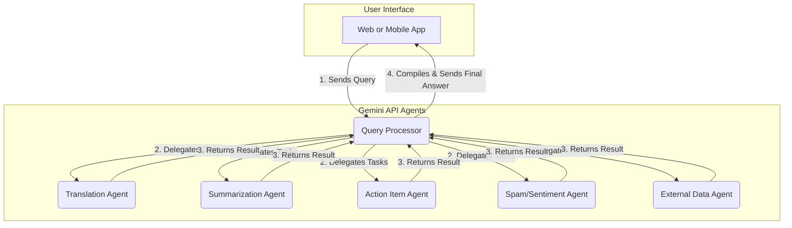

# BabelFetch

Your intelligent assistant for managing and understanding complex online conversations.

## The Problem

Instant messaging apps are a great way to communicate with friends, family, and colleagues. However, these platforms often lead to disorganized and overwhelming conversations. Important information gets buried, language barriers fragment communities, and spam or irrelevant messages increase the cognitive load of staying engaged. This makes it difficult to extract actionable insights or maintain meaningful connections.

---

## The Solution

BabelFetch leverages the **Gemini SDK** and **API agents** to provide a seamless way to organize, translate, summarize, and query your messaging history. By combining the power of advanced AI models and modular API agents, BabelFetch transforms chaotic conversations into actionable insights, enabling users to interact with their messaging platforms intelligently and efficiently.

---

## High-Impact Features

- **Real-Time Translation:** Instantly translate conversations into your preferred language.
- **Intelligent Summarization:** Get concise summaries of lengthy discussions.
- **Action Item Extraction:** Identify tasks, deadlines, and commitments from conversations.
- **Spam & Sentiment Analysis:** Filter out irrelevant messages and gauge the overall sentiment of a discussion.
- **Contextual Enrichment:** Enhance conversations with relevant external data, such as ratings, locations, or definitions.

---

## Agent-Centric Architecture with Gemini SDK

BabelFetch is built on the **Gemini SDK**, which enables the creation of modular and scalable API agents. These agents work collaboratively to process user queries, leveraging specialized capabilities to deliver accurate and actionable results.

